Visit the live site here: (https://arin-beauty.herokuapp.com/)


# Educational Purposes
This website is for educational purposes and checkout functionality is set up to accept stripe test card details. Please don't enter your personal card details.

To process a test stripe payment at checkout, please use the following details.

card number : 4242 4242 4242 4242
Any date
Any CVV number


# Mission Statement
- To provide an easily accessible site for the promotion and sale of beauty products. To showcase the Arin Beauty Products Company and its history and sustainability.

# Target Audience
- The target audience for ARIN Beauty Products is consumers who love to find all their beauty needs met in one effective site. Here they can find beauty products for sale, makeup tutorials, reviews and more. They can make a profile, have an order history and leave comments on the blog.

# Table Of Contents
## 1. [User Experience (UX)](#ux-design)
   * [Strategy](#strategy)
   * [Scope](#scope) 
   * [Structure](#structure)
   * [Strategy](#strategy)
   * [Skeleton](#skeleton)
   * [Surface](#surface)
## 2.[Information Architecture](#information-architecture)
   * [Database](#database)
   * [Data Model](#data-model)
## 3.[Technologies Used in the project](#technologies)
  * [Languages](#languages)
  * [Databases ](#databases)
  * [Libraries and frameworks](#libraries-and-frameworks)
  * [Other technologies](#other-technologies)  
## 4.[Testing]()
  * Located in a seperate testing file.[here!](TESTING.md)
## 5.[Deployment](#deployment)
  * [Deployment of the site](#site-deployment)
  * [How to run the code locally](#how-to-run-locally)
## 6.[Credits](#credits)
  * [Code](#code)
  * [Content](#content)
  * [Media](#media)
## 7.[Acknowledgment](#acknowledgments)

## [USER EXPERIENCE (UX)](#ux-design)
- ## [Strategy](#strategy)

  -  ## [Business Goals](#business-goals)
      * From a business point of view, I would like to have an attractive, trustworthy and fully functional website that is responsive on all devices.
      * I wish to have a website that immediately makes clear the purpose of it. In this case a website selling beauty products.
      * Products on the website can be easily modified using CRUD(create, read, update, delete) by the admin.
      * Users can easily register an account to promote revisits to the site.
      * An account will not be required however to visit the site, therefore maximizing the potential customer base.
      * Hold and secure information from all current and new customers so they may login to place orders.
      * I want to promote revisits by allowing customers who have purchased items to leave reviews and ratings.
      * I want a site that is easy to navigate using a search bar which will search using a product name or description.
      * I want the user to have the ability to break all products down into smaller categories. Such as eyes, face etc so it has high functionality and an overall high UX experience.
      * A trustworthy, safe and secure checkout and payment system to reassure customers that their private information is safe when used on this site.
      This is essential as no matter how good a product is if the payment system looks unsafe chances are I will lose sales and visits.

- ### [User Stories](#user-stories):
   
   - #### As a Shopper:
      1. I want to be able to view a list of products which relate to what I am searching for. E.g: moisturizer.
      2. I want to be able to select an individual product and access more information on that product. For example, an item which when clicked on will bring up a seperate page featuring an image, a description and a rating for the product I have clicked on.
      3. I want to be able to sort through the entire list of available products by breaking them into different categories. Example: eyes, face, lips etc.
      4. To make the site more user friendly I would like to be able to sort through the entire product content by rating, price low to high, price high to low, alphabetical order etc. This way I can quickly navigate to the item I am searching for.
      5. I would like to read reviews left by other customers who have purchased the same item.
      6. I also want to quickly search through the site. A search bar would help me easily navigate using a product name or description.
      7. My search results being at the top of the page would make usage clear and efficient.
      8. Should I decide to buy the product a clear 'Buy Now' button will be needed.
      9. A button to easily increase and decrease the quantity of the product I wish to buy is required.
      10. In the shopping cart I would like to see a running total so I can control my spending and avoid any nasty shocks caused by going over budget.
      11. Ability to edit quantity of items in the basket would increase the overall functionality of the site.
      12. The shopping cart should also feature a 'Continue Shopping' button.
      13. Once I've finished shopping I'd like to easily checkout and pay for my purchases.
      14. I want a payment method and process that is trustworthy, safe and secure.
      15. For added peace of mind, the ability to confirm my order before checkout to avoid mistakes. Example: ordering too high a quantity of a particular item.
      16. I want to recieve an email with confirmation of my order after purchase.
      17. After I have recieved my product, I want to be able to revisit the site to leave a review and a rating so other customers can benefit from my experience.

- ### As a site user:
     1. I would like the option to create an account for use on this site but as I might just want to browse I dont want this to be mandatory to access the sites content.
     2. Should I create an account I would like to easily login and logout to access my personal account info on my personalised account.
     3. I would like to receive an email confirmation after registering to be able to verify that registration was successful.
     4. I'd like to be able to easily recover my password incase I forget it so that I can recover access to my account.
     5. I'd like my profile to include my order history, order confirmation and the option to save my payment information.

- ### As a Store Owner:
     1. As admin , I want to have control of CRUD. I want to add new products when I choose.
     2. I want to edit and update a product when needed. Example: new make-up colours added etc.
     3. I want to be able to delete products when needed. Example: discontinued. Low sales due to negative reviews etc.


## [SCOPE](#scope)
The key features of the website is developed based on the user stories:
### For any site user:
 * A clear aim of the site. The home page features an image that shows some beauty products.
 * The logo in this case features the word beauty to highlight the products sold by the company.
 * The home page also features a banner which high-lights that delivery is free on orders above the amount shown.
 * A clear products page where users can view all items when the all products option is selected.
 * Clear pages to show each category when selected.
 * When the search bar is utilized, the top searches will be at the top of the page to maximize UX.
 * Product Detail page with detailed information about the selected product, this page will also be used to select the product for purchase and for increasing and decreasing the quantity required.
 * Shopping cart page, here customers can view their selected products for purchase. Edit quantity required and confirm their order before checkout.
 * Checkout page, allowing users to purchase products safely and securely.
 * Confirmation page which will show customers that their order was successful. An email will also be sent to the customers email account given while purchasing.
 * Contact page which can be used to contact the company when required.
 * About us page, where users can find the mission statement of the company.
 * A section where customers can review products that they have purchased.
 * A sign up page where users can register for an account. Here they will be able to veiw purchase history and have a personalised account.

## For registered users:
* Profile page, where users can update the default delivery information allowing ease of checkout.
* Users can see their order history from their profile page.
* Here customers can also leave a product review.
* Log out page, where users can securely log out of their page.

### For Store Owner:
  1. I would like to be able to add new products to the store.
  2. I would like to be able to edit and update a product from the store.
  3. I would like to be able to delete a product from the store.
  4. I would like to be able to delete reviews from users such as abusive or offensive messages left.
  5. Having control of CRUD will allow me to keep the site up to date and maintain a high standard of customer service.

## [STRUCTURE](#structure)
## Existing Features:
### Allauth features
The sign up, register, password reset, email confirmation pages etc, have all been provided by Django allauth and formatted to suit the needs of the site.
### Base Template
* Delivery Banner - The delivery banner contains information about free delivery and the free delivery threshold. It is fixed to the top of the screen to allow for ease of access and improved user navigation. It will change color when hovered over to make it stand out more.
* Along the top of the screen is a search bar. This will use Q to search through products using names and/or descriptions.
* Also along the top of the site the user will find links that will take users to different parts of the site which are as follows:
 * Unregistered user:
   * Login link
   * Register link
 * Registered user:
   * Wishlist
   * My Account - Profile, Logout
   * Cart
 * Admin/ superuser
   * Wishlist
   * My Account - Product Management, Profile, Logout
### Navbar
The navbar will have all the product category links and is fully adjustable across screen sizes.
* All Products - here products may be sorted and selected based on rating, price and categories.
* Cosmetics
    - Face
    - Eyes
    - Lips
    - All Cosmetics
* Skin Type
    - Sensitive
    - Dry
    - Oily
    - Combination
    - All Skin Types
* Skin Care
    - Moisturiser
    - Cleanser
    - Serum
    - All Skin Care
* Christmas
    - Gift Sets
* Blog
    - Our Story
### Blog Navbar
The main site navbar leads to a blog. When the blog button is clicked it leads to a new navbar and dropdown menus. The blog is a place where the sustainability promise to customers is shared along with a brief history of the company and introduction to the team.
Here, users can also access makeup tutorials, read reviews of products and leave comments. For now adding and deleting blog posts is only for authenticated users(admin.) In later edits of the site the ability to add posts will be made public but deletion will still be admin only.
* Blog
    - Blog Content
* About Us
    - About Us
* Categories
    - Foundation
    - Makeup Tutorials
* Makeup Tutorials
    - Videos
* Sustainability Promise
    - Our Promise

### Home
* Hero image and text to highlight use of site. Shop now button which connects to the all products page and gives users a view of what is on offer. 
### Products
* Featured images at the top of each main category page
* Product Category buttons so the user can select which sub-category they would like to look at
* Basic filtering options to sort products by category, name, price etc.
* Basic product info is displayed to the user such as the product image, name, price, category link, and for admins, edit/delete buttons
* Users can click on the product images which will take them to the product details page for that particular product
### Product Detail
* Breadcrumb links feature on these pages
* Product details shown to user; image, name, price, edit/delete buttons for admins and description
* Quantity selector that allows the user to choose the quantity they would like to purchase
* Keep Shopping button that takes the user back to the products page
* Add To Bag button that adds the product to the users shopping bag
* Review section with user reviews that can be viewed by all users regardless of registered status
* If a user is an admin they can edit/delete products. They can add products via product management.
### Shopping Bag
* Shows the user the product/s that they have in their bag
* Displays product image, name, size, SKU
* Quantity selector allows user to see how many they have in their shopping bag and amend that amount
* Subtotal shows the cost of the product, reflects changes upon quantity amendments
* Bag total, delivery and grand total show these amounts to the user
* Keep Shopping button allows the user to navigate back to the products page
* Secure Checkout buttons takes the customer to the Checkout page
### 404/500 Pages
* Page displayed when 404/500 error occurs
* Large text to display there is an error to the user
* Back To Home button so the user can navigate back to the home page
### Back To Top Button
 * Due to the large volume of the site a back to top button is required for easy navigation throughtout.
### Footer
The footer has all the important shop information such as opening hours, contact details and all the important heading links.
### Admin Features
  * Admin will have access to additional features across the site not accessible to other users.
### Post comments
 - Adding post comments would be a good way for users to interact with the admins of the site who have created the posts. They would also be able to add any additional info, or views and opinions on the posts. 
### Reviews
 - For users to review products
### Blog
 - For admin to post blogs and tutorials. Users can leave a comment under blog posts.
### Future Development Opportunities
* An add to favourites section/wishlist section for users to save their favourite products to purchase later.
* For the admin to be able to offer 'recommended products' to registered users based on past purchases in their order history.
[Structure](#structure)
Information Architecture

Database diagram made using [dbdiagram.io](https://dbdiagram.io/).
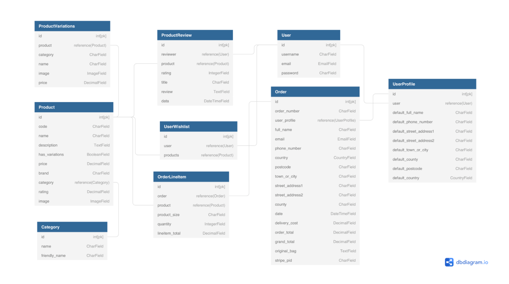

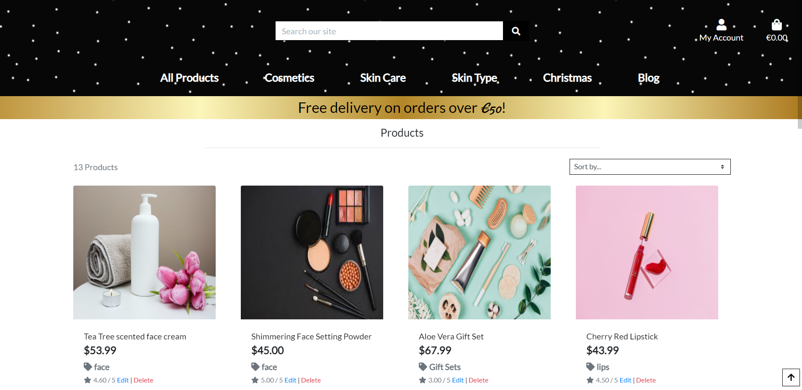
Products Models
Products App -
  Product: Holds the information for each individual product.
  Category: Holds the available categories for the products.

Review - related to Product and User. Stores Product Reviews. A Django signal updates the Product rating field when a review is added, deleted or edited.

Checkout Models
 - Order - related to OrderLineItem and UserProfile. Stores Orders after successful checkout. Order order_number field is automatically added on save.
 - Order discount, order_total, previous_total, delivery and grand_total fields are automatically updated using a Django signal when an - - -  - OrderLineItem is added or deleted.

 - OrderLineItem - related to Order, Type, Product and Size. Stores each OrderLineItem after successful checkout.
 - OrderLineItem line_item_total field is automatically calculated on save.

Profiles Models
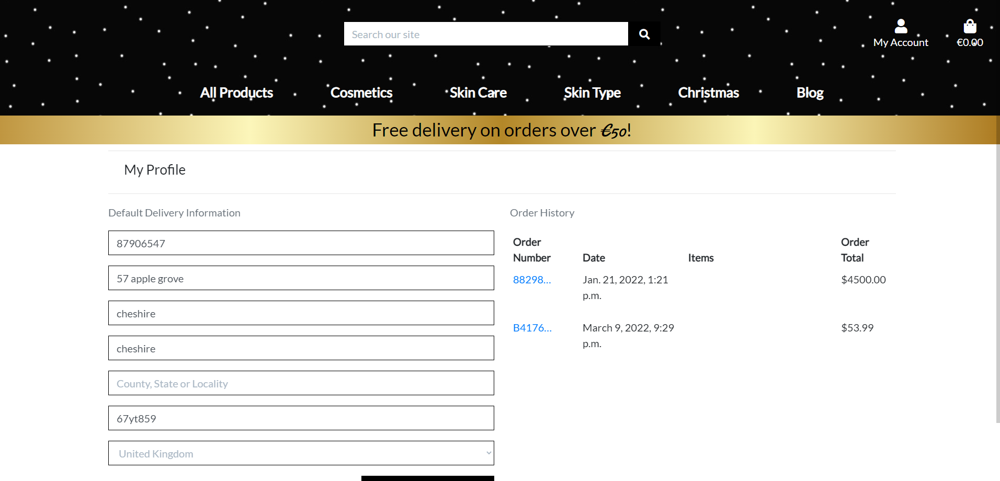
 - UserProfile - related to Order and User. Stores default delivery information. UserProfile is automatically created or updated using a Django receiver when a User object is updated or created.
 - Order History is stored in the user profile aswell.

Cart Models
Cart - related to User. Stripe webhooks.
 - Products App
    - Product: Holds the information for each individual product.
    - Category: Holds the available categories for the products.
    - Product Variations: Any variations of a specific product (sizes etc)

User
  - Created with django allauth containing the customer username, email and password.

User Profile App
  - User Profile: Holds user default delivery information

Admin Product Management
  - Add product form for admin to input a new product to the store.
  - If 'has variations' is selected, submitting the form will redirect the admin to add variations of the product.
  - Add product variations page displays existing variations and offers the admin the ability to add additional variations as well as edit and delete existing variations.

    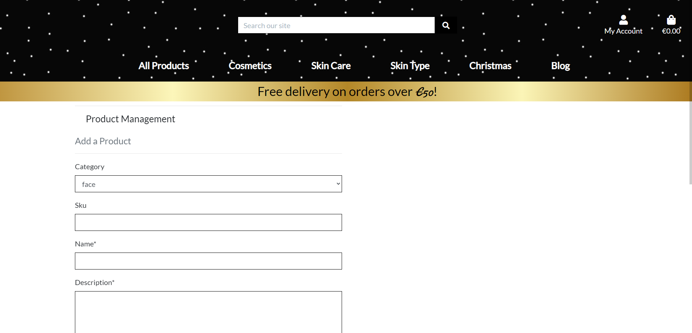

    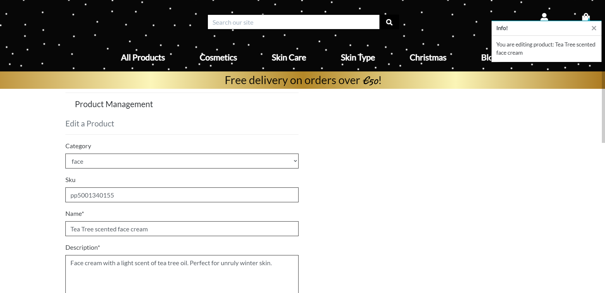

Messages/Toasts
 - Messages and Toasts are used when executing certain actions on the site, such as logging in and out, adding and removing products from the shopping bag, completing a transaction, and for admin actions too like adding and editing products.
## [Skeleton](#skeleton)
 - Wireframes
 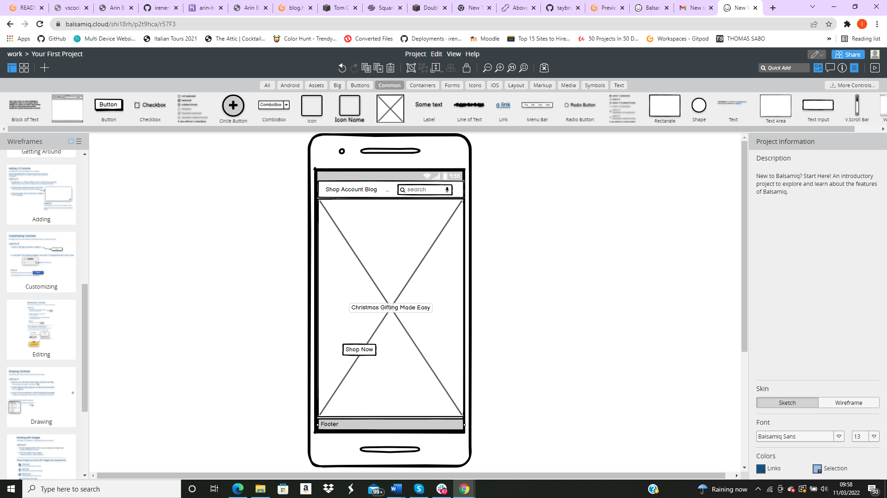
 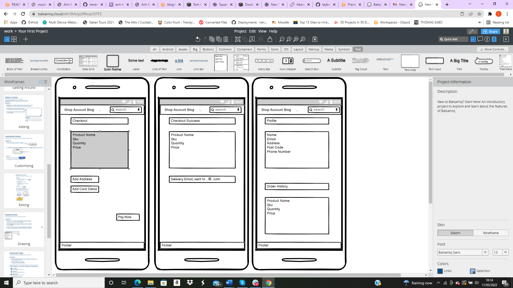
 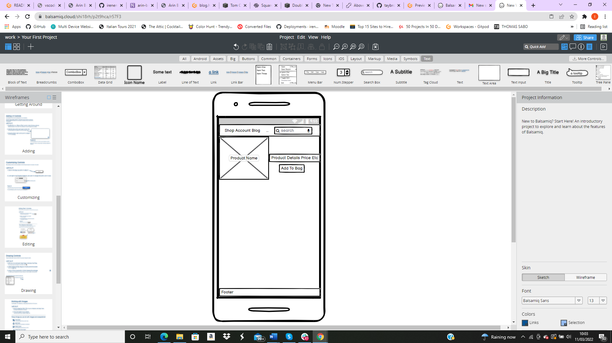
 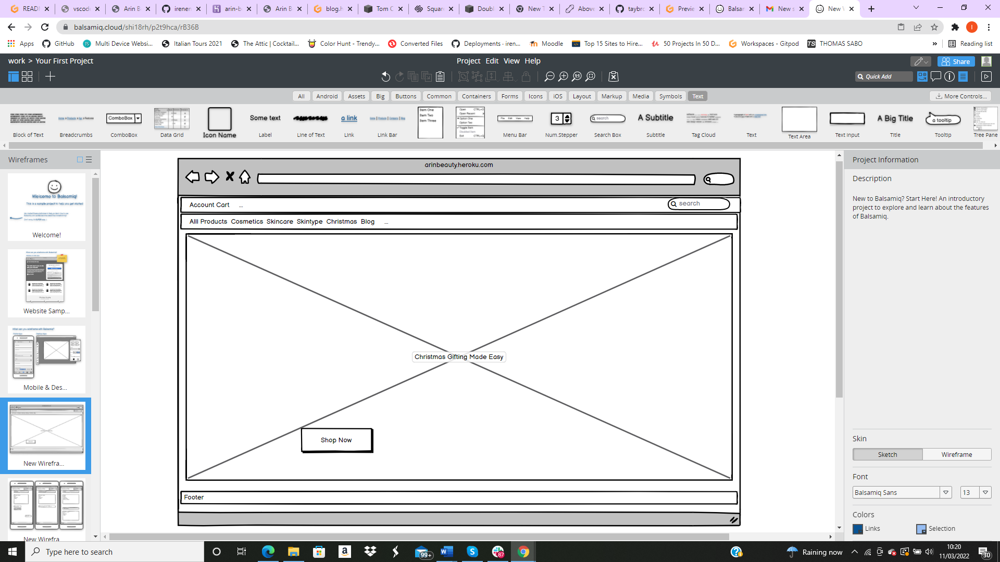
 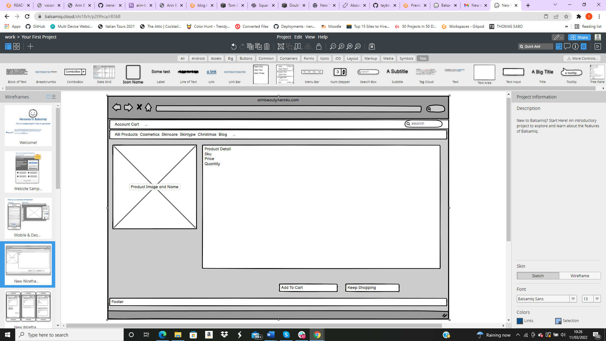
 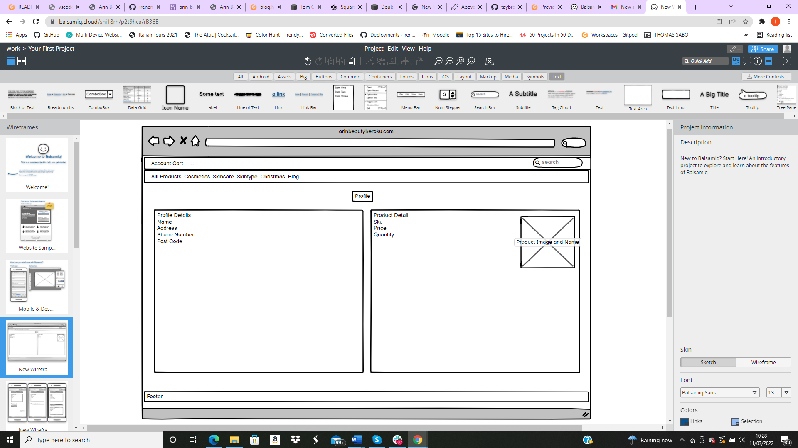
## [Surface](#surface)
### Colours
 - For the shopping pages I used a simple black and white theme with a gold banner which changes to silver when hovered over. This banner was taken from w3schools and adapted to suit my needs.
 - All products/checkout/sign up etc pages are white to help keep the site simple and user friendly.
### Images
 - The site header has an image of snow falling. This was used to create a christmas feels to the site. This effect was created using using online tutorials on youtube. ('online tutorials' is the company name). I got an image of snow from unsplash.com and used to video to add a motion effect.
 -  Some images were taken from freepik and the rest were taken from unsplash.com
 - For the blog pages I used images to create a warmer feeling background. I used images from unsplash to create this effect.
 - On the home page the logo is used to welcome people to the site. I got this logo made on fiverr.com.
 - On the main store page I used a large background image to welcome people to the site. The image is off christmas presents. There is a large 'shop now' button displayed here which connects to the products page.
### Fonts
 - Fonts were taken from Google Font 'Lato' and 'Damion'
 - Icons from Font Awesome.
google font for fonts and font awesome for icons


### Technologies
#### Integrated Development Environment
* GitHub
* Heroku

## Languages Used
- [Python3](https://www.python.org/downloads/)
- [JavaScript](https://www.javascript.com/)
- [CSS3](https://en.wikipedia.org/wiki/CSS)
- [HTML5](https://en.wikipedia.org/wiki/HTML5)

## Django and Associated Extensions

- [Django](https://www.djangoproject.com/)
    - Django was was used to create the project and code infrastructure. Django templating language was used when passing data between the Front-end and Back-end.

- [Django Allauth](https://django-allauth.readthedocs.io/en/latest/installation.html)
    - Allauth was used to create user registration and login functionality.

- [Django Countries](https://pypi.org/project/django-countries/)
    - Django Countries was used for formatting of the 'Country' field in the checkout form and in the default user info within the profile section.

- [Django Crispy Forms](https://django-crispy-forms.readthedocs.io/en/latest/)
    - Used to format the default django form fields across the site.


- [Django Coverage](https://pypi.org/project/django-coverage/)
    - Used to monitor coverage of automation testing written for the product, product_review and wishlist apps.

- Database

#### Development - SQLite
* Deployed site - Heroku PostgreSQL
#### Storage
* Amazon AWS S3 - used to store static files.
#### Payments
* Stripe - fully integrated payments platform.
#### Frameworks
* Django - web development framework.
* Bootstrap - to assist with responsive design.
* jQuery - to assist with JavaScript coding and DOM manipulation.
#### Tools & Libraries
* Balsamiq - used to produce Wireframes.
* Font Awesome
* Google Fonts
* django-allauth - user authentication and account management.
* boto3 - Amazon Web Services SDK for python. Used to configure Amazon Web Services S3 storage of static files.
* django-crispy-forms - enables enhanced rendering of Django forms including integration with Bootstrap.
* dj-database-url - Django database configuration utility. Used to configure connection to the Heroku deployed postgres database.
* django-countries - Django application providing country choices for use with forms etc. Used to populate country choices on the Country dropdowns.
* django-extensions - Collection of custom extensions for Django. Used to automatically export the final data schema diagram for the Django model.
* django-storages - Custom storage backends for Django. Used to configure Amazon Web Services S3 storage of static files.
* gunicorn - Python WSGI HTTP Server for UNIX. Used as part of the Heroku deployment process.
* pillow - Python imaging library.
* psycopg2 - PostgreSQL database adapter for Python. Used as part of the Heroku deployment process.
* pydot - Graphviz interface used to parse the Django data model into a .dot file using django-extensions.
* Flake8 - for python code validation.
* flake8-django - Flake8 plug-in for Django, for python code validation.
* LAMBDATEST - cross browser testing cloud, for testing across multiple browsers and operating systems.

Browser Support
Arin Beauty Products supports the following browsers:

* Google Chrome
* Microsoft Edge
* Safari
* Firefox
* Opera
### Full Deployment method
# Testing

Find the full Testing Document [here!](TESTING.md)

[Back to Contents](#table-of-contents)


[Structure](#structure)
Information Architecture

Database diagram made using [dbdiagram.io](https://dbdiagram.io/).


Products Models
Products App -
  Product: Holds the information for each individual product.
  Category: Holds the available categories for the products.

Review - related to Product and User. Stores Product Reviews. A Django signal updates the Product rating field when a review is added, deleted or edited.

Checkout Models
 - Order - related to OrderLineItem and UserProfile. Stores Orders after successful checkout. Order order_number field is automatically added on save.
 - Order discount, order_total, previous_total, delivery and grand_total fields are automatically updated using a Django signal when an - - -  - OrderLineItem is added or deleted.

 - OrderLineItem - related to Order, Type, Product and Size. Stores each OrderLineItem after successful checkout.
 - OrderLineItem line_item_total field is automatically calculated on save.

Profiles Models

 - UserProfile - related to Order and User. Stores default delivery information. UserProfile is automatically created or updated using a Django receiver when a User object is updated or created.
 - Order History is stored in the user profile aswell.

Cart Models
Cart - related to User. Stripe webhooks.
 - Products App
    - Product: Holds the information for each individual product.
    - Category: Holds the available categories for the products.
    - Product Variations: Any variations of a specific product (sizes etc)

User
  - Created with django allauth containing the customer username, email and password.

User Profile App
  - User Profile: Holds user default delivery information

Admin Product Management
  - Add product form for admin to input a new product to the store.
  - If 'has variations' is selected, submitting the form will redirect the admin to add variations of the product.
  - Add product variations page displays existing variations and offers the admin the ability to add additional variations as well as edit and delete existing variations.

    

    

Messages/Toasts
 - Messages and Toasts are used when executing certain actions on the site, such as logging in and out, adding and removing products from the shopping bag, completing a transaction, and for admin actions too like adding and editing products.

# Deployment
## Heroku Deployment with AWS
This website is deployed on [Heroku](https://www.heroku.com/), following these steps:
1. Install these packages to your local environment, since these packages are required to deploy a Django project on Heroku.
- [gnicorn](https://gunicorn.org/): `gnicorn` is Python WSGI(web server gataway interface) server for UNIX.
- [gninx](https://www.nginx.com/): `gninx` is a free, open-source, high-performance HTTP server and reverse proxy, as well as an IMAP/POP3 proxy server.
- [psycopg2-binary](https://pypi.org/project/psycopg2-binary/): `psycopg2-binary` is PostgreSQL database adapter for the Python programming language.
- [dj-database-url](https://pypi.org/project/dj-database-url/): `dj-database-url` allows you to utilize the 12factor inspired DATABASE_URL environment variable to configure your Django application.
2. Create a `requirements.txt` file and freeze all the modules with the command `pip3 freeze > requirements.txt` in the terminal.
3. Create a `Procfile` write `web: gunicorn bubbles.wsgi:application` in the file.
4. `git add` and `git commit` and `git push` all the changes to the Github repositoty of this project.
5. Go to Heroku and create a **new app**. Set a name for this app and select the closest region (Europe) and click **Create app**.
6. Go to **Resources** tab in Heroku, then in the **Add-ons** search bar look for **Heorku Postgres**(you can type postgres), select **Hobby Dev — Free** and click **Submit Order Form** button to add it to your project.
7. In the heroku dashboard for the application, click on **Setting** > **Reveal Config Vars** and set the values as follows:

| Key | Value |
| ----------- | ----------- |
| AWS_ACCESS_KEY_ID | `Your AWS Access Key` |
| AWS_SECRET_ACCESS_KEY | `Your AWS Secret Access Key` |
| DATABASE_URL | `Your Postgres Database URL` |
| EMAIL_HOST_PASS | `Your Email Password (generated by Gmail)` |
| EMAIL_HOST_USER | `Your Email Address` |
| SECRET_KEY | `Your Secret Key` |
| STRIPE_PUBLIC_KEY | `Your Stripe Public Key` |
| STRIPE_SECRET_KEY | `Your Stripe Secret Key` | 
| STRIPE_WH_SECRET | `Your Stripe WH Key` |
| USE_AWS | `True` |

* I used [Djecrety](https://djecrety.ir/) to generate Django Secret Key.

8. Comment out the current database setting in settings.py, and add the code below instead. This is done temporarily to migrate the datbase on Heroku.
```
  DATABASES = {     
        'default': dj_database_url.parse("<your Postrgres database URL here>")     
    }
```
9. Migrate the database models to the Postgres database using the following commands in the terminal:
`python3 manage.py migrate`
10. Load the data fixtures(products and categories) into the Postgres database using the following command:
`python3 manage.py loaddata <fixture_name>`
11. Create a superuser for the Postgres database by running the following command:
`python3 manage.py createsuperuser`
12. Replace the database setting with the code below, so that the right database is used depending on development/deployed environment.
```
if 'DATABASE_URL' in os.environ:
    DATABASES = {
        'default': dj_database_url.parse(os.environ.get('DATABASE_URL'))
    }
else:
    DATABASES = {
        'default': {
            'ENGINE': 'django.db.backends.sqlite3',
            'NAME': os.path.join(BASE_DIR, 'db.sqlite3'),
        }
    }
```
13. Disable collect static, so that Heroku won't try to collect static file with: `heroku config:set DISABLE_COLLECTSTATIC=1`
14. Add `'ms4-bubbles.herokuapp.com', 'localhost', '127.0.0.1'` to `ALLOWED_HOSTS` in settings.py.
```
ALLOWED_HOSTS = ['ms4-bubbles.herokuapp.com', 'localhost', '127.0.0.1']
```
15. In Stripe, add Heroku app URL a new webhook endpoint.
16. Update the settings.py with the new Stripe environment variables and email settings.
17. Commit all the changes to Heroku. Medial files are not connected to the app yet but the app should be working on Heroku.

### Amazon Web Service S3
The static files and media files for this deployed site (e.g. image files for product/blog) are hosted in the [AWS](https://aws.amazon.com/) S3 Bucket. You will need to create S3 bucket, complete the setting up and upload static files and media files to the S3 bucket. You can find [Amazon S3 documentation](https://docs.aws.amazon.com/AmazonS3/latest/gsg/CreatingABucket.html) for more information on the setting.
I used CORS configuration below:
```
[
  {
      "AllowedHeaders": [
          "Authorization"
      ],
      "AllowedMethods": [
          "GET"
      ],
      "AllowedOrigins": [
          "*"
      ],
      "ExposeHeaders": []
  }
]
```

- Setting for static/media files in settings.py
1. Install `boto3` and `django-storages` with a command `pip3 install boto3` and `pip3 install django-storages` in your terminal, to connect AWS S3 bucket to Django.
2. Add 'storages' to `INSTALLED_APPS` in settings.py.
3. Add the following in settings.py.
```
if 'USE_AWS' in os.environ:
    # Cache Control
    AWS_S3_OBJECT_PARAMETERS = {
        'Expires': 'Thu, 31 Dec 2099 20:00:00 GMT',
        'CacheControl': 'max-age=94608000',
    }

    # Bucket Config
    AWS_STORAGE_BUCKET_NAME = 'ms4-bubbles'
    AWS_S3_REGION_NAME = 'eu-central-1'
    AWS_ACCESS_KEY_ID = os.getenv('AWS_ACCESS_KEY_ID')
    AWS_SECRET_ACCESS_KEY = os.getenv('AWS_SECRET_ACCESS_KEY')
    AWS_S3_CUSTOM_DOMAIN = f'{AWS_STORAGE_BUCKET_NAME}.s3-eu-central-1.amazonaws.com'

    # Static and media files
    STATICFILES_STORAGE = 'custom_storages.StaticStorage'
    STATICFILES_LOCATION = 'static'
    DEFAULT_FILE_STORAGE = 'custom_storages.MediaStorage'
    MEDIAFILES_LOCATION = 'media'

    # Override static and media URLs in production
    STATIC_URL = f'https://{AWS_S3_CUSTOM_DOMAIN}/{STATICFILES_LOCATION}/'
    MEDIA_URL = f'https://{AWS_S3_CUSTOM_DOMAIN}/{MEDIAFILES_LOCATION}/'
```
5. Add [custom_storages.py](https://github.com/gomathishankar28/ms4-bubbles/blob/master/custom_storages.py).
6. Delete DISABLE_COLLECTSTATIC from Heroku Config Var.
7. Push all the changes to Github/Heroku and all the static files will be uploaded to S3 bucket.
By setting up above, Heroku will run python3 manage.py collectstatic during the build process and look for static and media files.

### Automatic Deploy on Heroku
You can enable automatic deploy in the following steps that pushes update to Heroku everytime you push to github.
1. Go to Deploy in Heroku dashboard.
2. At `Automatic deploys`, choose a github repository you want to deploy.
3. Click `Enable Automatic Deploys`.


## How to Clone 
1. Navigate to the GitHub Repository.
2. Click the Code drop down menu.
3. Either Download the ZIP file, unpackage locally and open with IDE (This route ends here) OR Copy Git URL from the HTTPS dialogue box.
4. Open your developement editor of choice and open a terminal window in a directory of your choice.
5. Use the git clone command in terminal followed by the copied git URL.
6. A clone of the project will be created locally on your machine.

Once the project has been loaded into an IDE of choice, run the following command in the shell to install all the required packages: pip install -r requirements.txt.

### **How to Fork the respository**

1. Log into GitHub.
2. In Github go to (https://github.com//irenenev24/arin-beauty-ms4).
3. In the top right hand corner click "Fork".

### **Credits**
* **Content**

* **Media**

    images from unsplash.com

* **Code**

	* [Bootsrap](https://getbootstrap.com/) for navbar, collapsible, cards

	* [W3Schools](https://www.w3schools.com/) as a general source.

  * [stackoverflow](https://stackoverflow.com/) for general code reference

  * [code Institute]for general tips and advice

    
### **Acknowledgements**
    
* **My mentor: Briam Macharia** 
* **The Slack community** of Code Institute for a peer code review.
* **My Family and Friends** who provided their feedback by testing the website across different devices and different OS for me.

